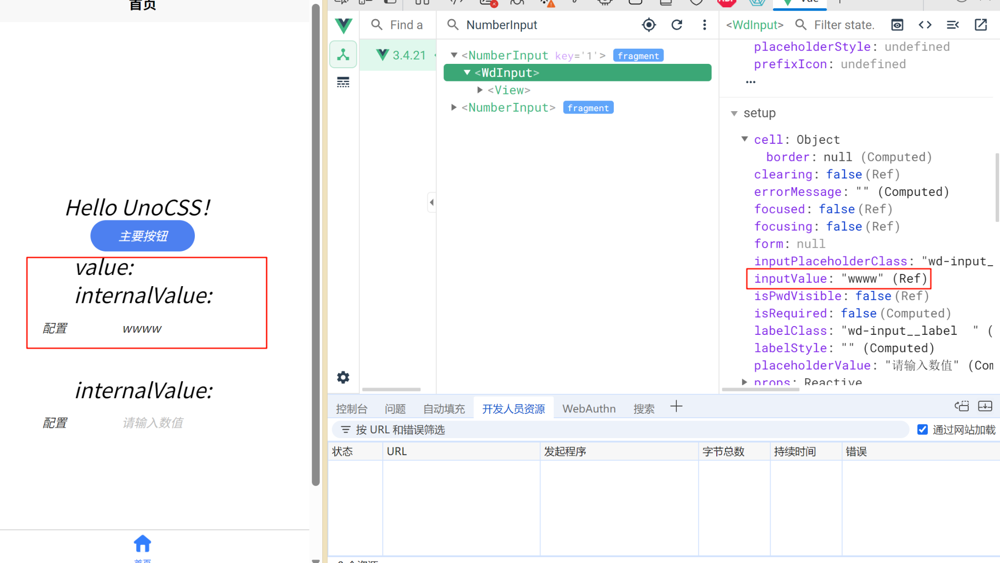

# install
```bash
pnpm i
```

基于wd-input 二次封装
只允许输入数字，限制小数位数（precision），支持千分位分隔符

bug：
```
现在有个问题是， 我输入非数字的或者多个小数位数的(默认两位)，
实际的值变了， 但是wd-input内部控制数值显示的inputValue没变化
我期望的是和internalValue同步

有没有什么好的解决方法
```

